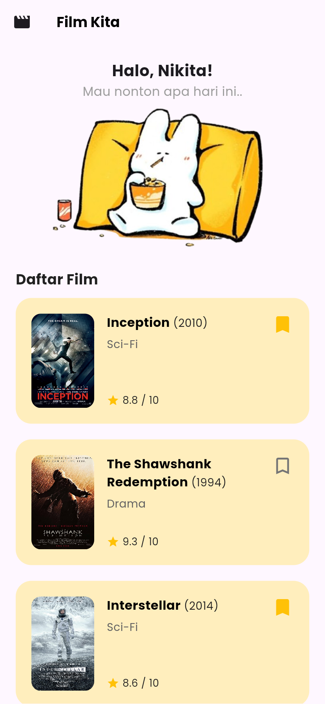
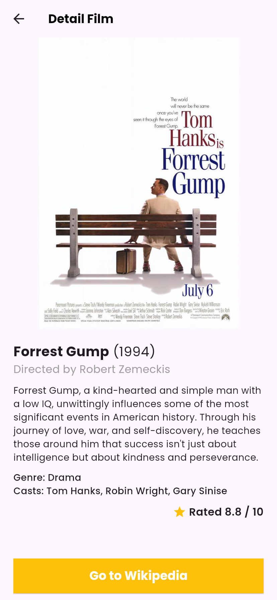

# 🎬 Movie List App


A simple Flutter application for browsing and managing a list of movies.
This project includes a login system, movie list display, movie detail page, and a bookmark feature for saving favorite movies.

---

# 📱 App Preview

| Login Page                      | Movie List                    | Movie Detail                      |
| ------------------------------- | ----------------------------- | --------------------------------- |
|  |  |  |

---

# 🔐 Login Credentials

| Username | Password |
| -------- | -------- |
| nikita   | 044      |

---

# 🛠️ Tech Stack

* **Framework** : Flutter
* **Language** : Dart
* **Font** : Google Fonts (Poppins)

---

# 📂 Project Structure

```
lib/
 ├── components/
 │    ├── movie_tile.dart
 │    └── text_field.dart
 │
 ├── models/
 │    ├── movie_model.dart
 │    └── user.dart
 │    └── watchlist_model.dart
 │
 ├── screen/
 │    ├── login_page.dart
 │    ├── movie_list_page.dart
 │    └── movie_detail_page.dart
 │
 └── main.dart
```

---

# 🚀 Getting Started

1. Clone this repository

```
git clone https://github.com/nikita74939/LatKuis-123230044.git
```

2. Go to the project folder

```
cd LatKuis-123230044
```

3. Install dependencies

```
flutter pub get
```

4. Run the project

```
flutter run
```

---

Made with Flutter ⭐
